.. Nornir documentation master file, created by
   sphinx-quickstart on Sat Jul 31 12:58:42 2021.
   You can adapt this file completely to your liking, but it should at least
   contain the root `toctree` directive.

欢迎阅读 Nornir 中文手册！
==================================

.. image:: _static/logo/nornir_logo_02.jpg
   :height: 350px
   :width: 350px
   :target: https://github.com/nornir-automation/nornir

本手册是基于 `官方文档 <https://nornir.readthedocs.io/en/latest>`_ 的不完全翻译，内容相比官方文档有些增删改动，希望对想要使用 Nornir 的朋友有所帮助。

本人能力有限，文中难免会有疏漏或表意不当的地方，欢迎大家随时指正：vip@xdai.vip。

Contents
========

.. toctree::
   :maxdepth: 1

   主页 <self>
   入门教程 <tutorial/index>
.. Howto <howto/index>
.. configuration/index
.. plugins/index
.. Upgrading <upgrading/index>
.. Contribute <contributing/index>
.. Changelog <changelog/index>
.. api/index

Nornir 一览图
-------------------

下图包含了 Nornir 的大部分概念及简单的交互逻辑，希望可以帮助刚开始使用 Nornir 的朋友稍微加深一些理解。

如有纰漏之处，还请指正。

Indices and tables
==================

* :ref:`genindex`
* :ref:`modindex`
* :ref:`search`
