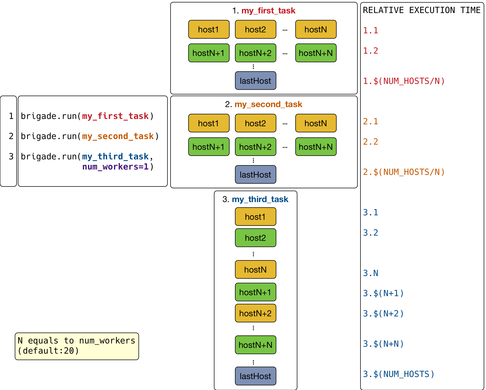
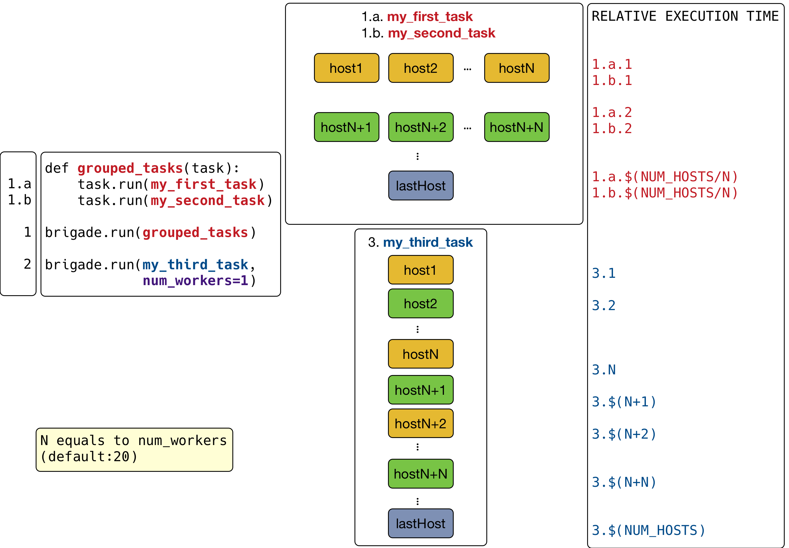

线程插件执行模型
=================

Nornir 优点之一是它可以并行执行任务，工作方式如下：

1. 你可以通过带有参数 ``num_workers > 1`` (默认值是 ``20``) 的 ``nornir.core.Nornir.run`` 对象运行任务以达到并行的目的；
2. 如果 ``num_workers == 1`` ，nornir 通过简单的循环一个接一个地在所有主机上运行任务，通常用于故障排除/调试、写入磁盘/数据库或仅在屏幕上打印内容；
3. 并行执行任务时，nornir 会为每个主机使用不同的线程。

下面这个图说明了工作流程：

Nornir 也支持创建包含其他任务的任务，即 **任务组（Grouping tasks）** 。当运行任务组时，同一个子任务在所有主机上并行执行，子任务之间按顺序执行，这样就可以按照特定的需求来控制执行流程。

例如，可以编写如下工作流：

为什么要编写这样的工作流？大多数情况下，我们会尽可能多的将任务拆分进而形成不同的任务组，这样就可以保证脚本运行的更快，尤其是有很多主机的时候。 但是，某些任务可能需要在确保其他一些任务完成后才能运行。例如如下场景：

1. 并行进行多台主机的配置
2. 并行进行配置验证及测试
3. 按照顺序启动服务
